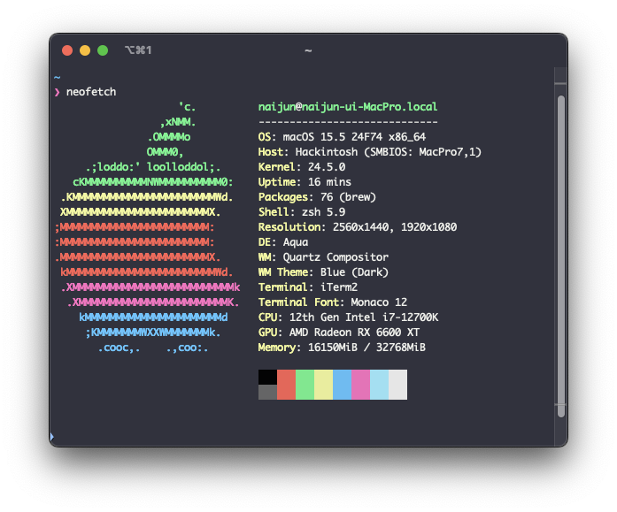

# MyEFI
[](https://www.apple.com/macos)
[](https://github.com/acidanthera/OpenCorePkg)



## Disclaimer
Use at your own risk. I'm not responsible if your equipment explodes.

## How to build
The SMBIOS model name is specified, but things like the detailed serial number are not committed with it.

However, you can specify these yourself and build them.

Put the values in `secret-properties.json` and run
```sh
python build.py
```

## OpenCore Version
OpenCore 1.0.4

## Currently Support macOS Version
macOS Sequoia 15.5 x86_64

## My Hardware Spec
```
Motherboard: GIGABYTE Z790 AORUS ELITE X WIFI7
CPU: i7-12700K
GPU: AMD Radeon RX 6600 XT
RAM: DDR5 32GB
```